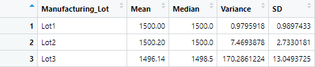
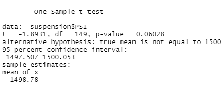
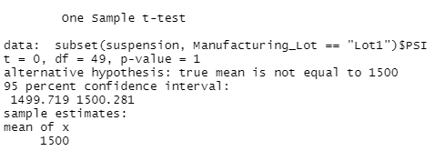
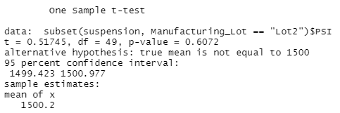
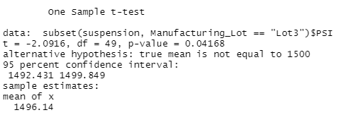

# Linear Regression to Predict MPG
Multiple linear regression was carried out to determine the effect of a MechaCar's length, weight, spoiler angle, ground clearence, and presence of AWD on its mpg.

### MLR

### Statistics

### Analysis 
- Ground clearence (p = 5.21e-08) and vehicle length (p = 2.60e-12) have statistically significant effects on the mpg of MechaCars. The presence of the intercept (p = 5.08e-08) suggests that there are other factors that significantly influence the MechaCars' mpg that are not present in this dataset.
- Since there are multiple non-zero coefficients in the data set, the regression line will have a non-zero slope.
- An R-squared value of 0.71 indicates that the regression model has a strong correlation with the MechaCar data.

# Summary Statistics on Suspension Coils
A statistical summary was carried out on the suspension coil data for both the whole data set and separated by lot.

### Total Summary

### Lot Summary

### Analysis
The overall variance of PSI accross all three lots meets specification, but this is misleading data. In reality, lots 1 and 2 have excellent variance (1 PSI and 7.5 PSI respectively), but lot 3 does not meet specification at 170.3 PSI of variance.

# T-Tests on Suspension Coils
T-tests were carried out on the full population, as well as on the three lots individually, comparing the PSI of the cars on that lot to the general population mean of 1500 PSI.

### All Lots

### Lot 1

### Lot 2

### Lot 3

### Analysis
The full selection of cars across all lots failed the null hypothesis with a p value of 0.06, indicating that it was likely a random selection of cars. Lots 1 and 2 (p values 1 and 0.61) showed random sampling as well, but lot 3 (p = 0.04) shows an outside factor that influenced the PSI of the cars there.