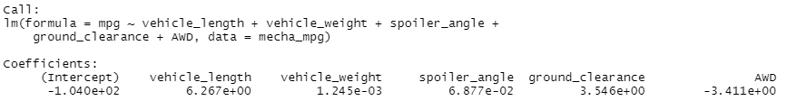
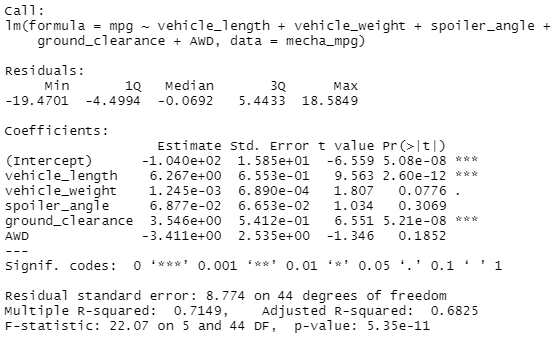

# MechaCar_Statistical_Analysis
## Linear Regression to Predict MPG
Multiple linear regression was carried out to determine the effect of a MechaCar's length, weight, spoiler angle, ground clearence, and presence of AWD on its mpg.

MLR:

Statistics:

